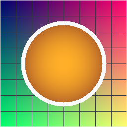

# sml-image

Pure-Standard-ML **raster image codecs** over a single in-memory
representation: 8-bit RGBA, row-major, top-left origin. No FFI, no C — just the
Basis Library plus two pure-SML dependencies. Deterministic and byte-identical
across [MLton](http://mlton.org/) and [Poly/ML](https://www.polyml.org/).



*Generated by [`examples/demo.sml`](examples/demo.sml) (`make example`): a raster
built purely from integer arithmetic, encoded with `Image.encodePng` and
round-tripped back through `Image.decode`. The PNG is byte-identical on both
compilers.*

| Format | Decode | Encode |
| ------ | :----: | :----: |
| **PNM** (PPM `P3`/`P6`, PGM `P2`/`P5`) | yes | `P6` (PPM) & `P5` (PGM) |
| **BMP** (uncompressed 24/32-bit, top-down & bottom-up) | yes | 32-bit top-down |
| **TGA** (uncompressed truecolor, type 2, 24/32-bit) | yes | 32-bit |
| **PNG** (8-bit gray / GA / RGB / RGBA; filters None/Sub/Up/Average/Paeth) | yes | 8-bit RGBA |

PNG decoding integrates the vendored [`sml-inflate`](https://github.com/sjqtentacles/sml-inflate)
for zlib/DEFLATE plus its CRC-32 / Adler-32; [`sml-color`](https://github.com/sjqtentacles/sml-color)
is vendored for color-space helpers.

## Installation

With [`smlpkg`](https://github.com/diku-dk/smlpkg):

```sh
smlpkg add github.com/sjqtentacles/sml-image
smlpkg sync
```

Then reference `lib/github.com/sjqtentacles/sml-image/...` from your `.mlb` (or
build directly from `src/image.mlb`, which already pulls in the vendored deps).

## The image type

```sml
type image = { width : int, height : int, data : Word8Vector.vector }
(* data length is exactly 4 * width * height: [R,G,B,A, R,G,B,A, ...] *)
```

## API

```sml
exception Image of string

type rgba8 = { r : Word8.word, g : Word8.word, b : Word8.word, a : Word8.word }
val getPixel : image -> int * int -> rgba8
val setPixel : image -> int * int -> rgba8 -> image
val fill     : int * int -> rgba8 -> image

val decodePnm : Word8Vector.vector -> image
val encodePpm : image -> Word8Vector.vector
val encodePgm : image -> Word8Vector.vector

val decodeBmp : Word8Vector.vector -> image
val encodeBmp : image -> Word8Vector.vector

val decodeTga : Word8Vector.vector -> image
val encodeTga : image -> Word8Vector.vector

val decodePng : Word8Vector.vector -> image
val encodePng : image -> Word8Vector.vector

datatype format = PNM | BMP | TGA | PNG
val detect : Word8Vector.vector -> format option
val decode : Word8Vector.vector -> image   (* sniff + dispatch *)
```

Malformed, truncated, or unsupported input raises `Image msg` (including PNG CRC
/ zlib-checksum failures) rather than a generic `Match`/`Subscript`.

## Example

```sml
(* Load whatever a blob happens to be, recolor a pixel, save as PNG. *)
val img  = Image.decode blob
val img' = Image.setPixel img (0, 0) { r=0wxFF, g=0w0, b=0w0, a=0wxFF }
val png  = Image.encodePng img'
```

## Building & testing

```sh
make test        # build + run under MLton
make test-poly   # run under Poly/ML
make all-tests   # both compilers
make example     # render assets/demo.png (the image above)
make fixtures    # regenerate test/fixtures.sml (needs python3)
```

### Test fixtures

The PNG fixtures in `test/fixtures.sml` are produced **outside this repo** by
Python's `zlib` with manual chunk assembly (`bin/gen_fixtures.py`), exercising
every filter type (None/Sub/Up/Average/Paeth) and color type (grayscale,
grayscale+alpha, RGB, RGBA) against a known raster. This validates the decoder
against an independent encoder. BMP/TGA/PNM are checked via encode/decode
round-trips and hand-built byte streams; edge cases cover 1×1 and 0-dimension
images, BMP row padding, TGA origin/flip, out-of-range access, truncated files,
bad signatures, and checksum mismatches.

## Notes & limitations

- PNG: 8-bit depth, non-interlaced. Palette (color type 3) and 16-bit depth are
  rejected with a clear error rather than mis-decoded.
- The PNG encoder writes filter-None scanlines inside *stored* (uncompressed)
  DEFLATE blocks wrapped in a valid zlib stream — small and trivially correct,
  decodable by any conformant inflater (it round-trips through `sml-inflate`).

## License

See [LICENSE](LICENSE).
